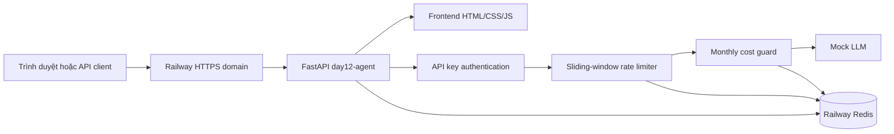
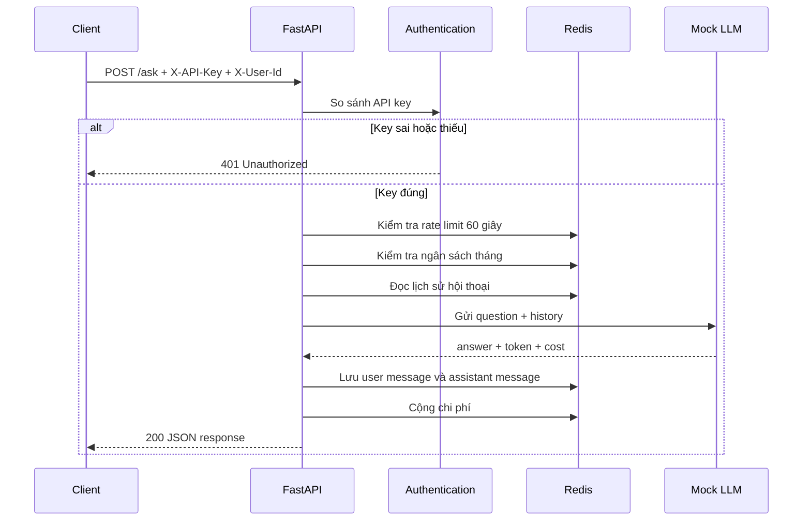

# Báo cáo chi tiết bài lab Day 12 — Hạ tầng Cloud & Deployment

**Học viên:** Nguyễn Gia Bảo  
**Mã học viên:** 2A202601938  
**Repository:** [Potato1476/Day12-2A202601938-NguyenGiaBao](https://github.com/Potato1476/Day12-2A202601938-NguyenGiaBao)  
**Service public:** [day12-agent-production-2b44.up.railway.app](https://day12-agent-production-2b44.up.railway.app)

---

## 1. Bài lab này giải quyết vấn đề gì?

Bài lab biến một AI agent đang chạy trên máy cá nhân thành một dịch vụ có thể
chạy ổn định trên cloud. Trọng tâm không phải làm mô hình AI phức tạp, mà là
những lớp hạ tầng cần có để đưa một ứng dụng Python từ môi trường phát triển
lên production:

- Cấu hình bằng biến môi trường thay vì viết cứng trong source code.
- Đóng gói ứng dụng thành Docker image có kích thước hợp lý và an toàn hơn.
- Bảo vệ API bằng API key, rate limit và giới hạn chi phí.
- Lưu state trong Redis để nhiều instance dùng chung dữ liệu.
- Phân biệt process còn sống với service đã sẵn sàng nhận request.
- Xử lý tắt ứng dụng đúng cách khi deploy phiên bản mới.
- Deploy service và Redis lên Railway, tạo URL HTTPS công khai.
- Tạo giao diện web mô tả bài lab và hiển thị trạng thái thật của backend.
- Tự động kiểm tra bằng Pytest và GitHub Actions.

Lab dùng `mock_llm.py`, tức là LLM giả lập chạy offline. Vì vậy ứng dụng
không cần Google, Gemini hay OpenAI API key. `AGENT_API_KEY` trong bài là khóa
bảo vệ endpoint `/ask`, không phải khóa của nhà cung cấp mô hình AI.

## 2. Output cuối cùng của bài lab

Sau khi hoàn thiện, sản phẩm gồm:

1. Một FastAPI service có các endpoint `/`, `/health`, `/ready` và `/ask`.
2. Một Docker image production-ready chứa cả backend và frontend tĩnh.
3. Một Redis service lưu lịch sử, rate limit và số tiền đã sử dụng.
4. Ba agent replica có thể chạy đồng thời ở môi trường Docker Compose local.
5. Một bản deploy Railway có URL HTTPS công khai.
6. Một trang web giới thiệu nội dung lab và kiểm tra live service.
7. Bộ test theo năm checkpoint và file chấm điểm tự động.
8. Mười câu trả lời phản ánh trong `exercises.md`.
9. Workflow CI/CD chạy test và build Docker image khi push code.

Các response quan trọng cần đạt:

| Request | Output mong đợi | Ý nghĩa |
|---|---:|---|
| `GET /` | `200` | Frontend đã được phục vụ từ container |
| `GET /health` | `200 {"status":"ok", ...}` | Process FastAPI còn sống |
| `GET /ready` | `200 {"status":"ready","redis":true}` | Agent đã kết nối Redis |
| `POST /ask` không có key | `401` | API được bảo vệ |
| `POST /ask` có key hợp lệ | `200` | Agent xử lý được câu hỏi |
| Gọi quá giới hạn | `429` | Rate limiter hoạt động |
| User vượt ngân sách | `402` | Cost guard hoạt động |

## 3. Kiến trúc tổng thể



Frontend không phải một service riêng. Các file trong `app/static/` được
copy chung vào Docker image bằng lệnh `COPY app ./app`. FastAPI trả
`index.html` tại `/` và mount tài nguyên tại `/static`. Cách này phù hợp với
quy mô bài lab vì chỉ cần một image, một domain và không phải xử lý CORS giữa
hai service.

Ở local, Docker Compose có thể scale agent thành ba process:

```text
agent:8000 ─┐
agent:8001 ─┼──► cùng đọc/ghi Redis
agent:8002 ─┘
```

Mỗi agent có RAM riêng nhưng state quan trọng không nằm trong RAM. Vì cả ba
dùng chung Redis nên request của cùng một user đi vào instance nào cũng đọc
được lịch sử trước đó.

## 4. Công nghệ sử dụng

| Thành phần | Công nghệ | Vai trò |
|---|---|---|
| Web API | FastAPI | Định nghĩa endpoint và dependency injection |
| Runtime | Python 3.11, Uvicorn | Chạy ASGI application |
| Config | Pydantic Settings | Đọc và kiểm tra biến môi trường |
| State | Redis | Lịch sử, rate limit và chi phí |
| Test | Pytest, HTTPX, fakeredis | Test unit, integration và cloud |
| Container | Docker, Docker Compose | Đóng gói và chạy cả stack |
| Cloud | Railway | Host agent, Redis và public domain |
| CI/CD | GitHub Actions | Test và build image tự động |
| Frontend | HTML, CSS, JavaScript | Giới thiệu lab và live probes |

## 5. Luồng xử lý một request `/ask`



Thứ tự trên rất quan trọng. Authentication, rate limit và cost guard phải
chạy trước bước gọi LLM. Nếu chặn sau khi đã gọi LLM thì tài nguyên và tiền đã
bị tiêu dù cuối cùng client chỉ nhận response lỗi.

## 6. Checkpoint 1 — 12-Factor Config, Health và Logging

### 6.1. Cấu hình 12-Factor

`app/config.py` định nghĩa một lớp `Settings`. Các giá trị được đọc từ biến
môi trường:

| Biến | Kiểu | Mặc định | Ghi chú |
|---|---|---:|---|
| `PORT` | `int` | `8000` | Railway tự cấp khi chạy cloud |
| `AGENT_API_KEY` | `str` | Không có | Bắt buộc để bảo vệ `/ask` |
| `REDIS_URL` | `str` | `redis://localhost:6379/0` | Địa chỉ Redis |
| `RATE_LIMIT_PER_MINUTE` | `int` | `10` | Số request/user/60 giây |
| `MONTHLY_BUDGET_USD` | `float` | `10.0` | Ngân sách tháng của mỗi user |
| `LOG_LEVEL` | `str` | `INFO` | Mức độ log |

`AGENT_API_KEY` cố ý không có giá trị mặc định. Nếu quên cấu hình khóa, ứng
dụng phải fail fast thay vì âm thầm chạy với một khóa dễ đoán như `changeme`.

`get_settings()` dùng `@lru_cache`, vì các biến cấu hình không cần được đọc và
parse lại ở mọi request.

### 6.2. Structured logging

`app/logging_utils.py` ghi mỗi sự kiện thành đúng một JSON object trên một
dòng stdout. Ví dụ:

```json
{"event":"ask_completed","level":"info","timestamp":"2026-08-10T02:43:55+00:00","user_id":"sv-scale","tokens_in":6,"tokens_out":40,"cost_usd":0.0000249}
```

Log có cấu trúc cho phép hệ thống cloud lọc theo `event`, thống kê token, cộng
chi phí theo `user_id` hoặc dựng cảnh báo. Một câu `print("xong")` không cung
cấp đủ dữ liệu để máy thực hiện các việc đó.

### 6.3. Liveness endpoint

`GET /health` chỉ trả lời process có còn sống không. Endpoint này cố ý không
gọi Redis. Nếu Redis lỗi tạm thời mà health cũng lỗi, orchestrator sẽ restart
các container đang chạy tốt và có thể tạo vòng lặp restart.

## 7. Checkpoint 2 — Docker production-ready

### 7.1. Multi-stage build

Dockerfile có hai stage:

1. `builder`: cài dependencies vào `/install`.
2. `runtime`: chỉ copy dependencies đã cài, source code và static assets.

Runtime dùng `python:3.11-slim`, không mang compiler và công cụ build không
cần thiết sang image cuối. Image đo được khoảng `209 MB`, nhỏ hơn nhiều so
với bản một stage dùng base Python đầy đủ khoảng `1.11 GB`.

### 7.2. Tận dụng Docker layer cache

`requirements.txt` được copy và cài trước source code:

```dockerfile
COPY requirements.txt .
RUN pip install --no-cache-dir --prefix=/install -r requirements.txt
```

Sau đó mới copy `app/` và `utils/`. Vì vậy sửa một dòng Python không làm Docker
cài lại toàn bộ thư viện. Chỉ các layer source phía sau cần được tạo lại.

### 7.3. Không chạy bằng root

Image tạo user `appuser` với UID `10001`, rồi chuyển sang user này bằng
`USER appuser`. Nếu code bị khai thác, process bị chiếm quyền chỉ có quyền của
user thường, giảm hậu quả so với việc attacker có quyền root trong container.

### 7.4. Healthcheck và cổng động

Docker healthcheck gọi `/health`. Uvicorn bind vào `0.0.0.0` và đọc `$PORT`:

```dockerfile
CMD ["sh", "-c", "uvicorn app.main:app --host 0.0.0.0 --port ${PORT:-8000}"]
```

Việc chạy qua `sh -c` là cần thiết để `${PORT:-8000}` được shell mở rộng.
Đây cũng là phần đã sửa khi Railway build thành công nhưng healthcheck thất
bại vì tiến trình không lắng nghe đúng cổng platform cấp.

### 7.5. Docker Compose

Compose chạy hai loại service:

- `redis`: Redis 7 Alpine, có volume và healthcheck `redis-cli ping`.
- `agent`: build từ Dockerfile, chờ Redis healthy, nhận secret từ `.env`.

Lệnh chạy ba replica:

```bash
docker compose up -d --build --scale agent=3
docker compose ps
```

Ba replica được map lần lượt ra các cổng `8000`, `8001`, `8002`.

## 8. Checkpoint 3 — Bảo mật API và kiểm soát tài nguyên

### 8.1. API key authentication

`app/auth.py` đọc header `X-API-Key` và so sánh với `AGENT_API_KEY` bằng
`secrets.compare_digest`. So sánh constant-time hạn chế timing attack tốt hơn
so với dùng toán tử `==` thông thường.

Header `X-User-Id` xác định user dùng cho lịch sử, rate limit và cost guard.
Nếu client không gửi user ID thì service dùng `anonymous`.

### 8.2. Sliding-window rate limiter

Mỗi user có một Redis Sorted Set với key `ratelimit:<user_id>`:

- Score là timestamp của request.
- Trước khi đếm, xóa entry cũ hơn 60 giây.
- Nếu số entry đã bằng giới hạn, trả `429 Too Many Requests`.
- Nếu còn quota, thêm member duy nhất và đặt TTL 60 giây.

Sliding window ngăn lách giới hạn ở ranh giới phút. Với fixed window, user có
thể gửi 10 request lúc `10:00:59` và 10 request lúc `10:01:00`, tức 20 request
trong khoảng hai giây nhưng vẫn không vượt 10 request của từng phút đồng hồ.

### 8.3. Monthly cost guard

Mỗi user có key dạng `cost:<user_id>:<YYYY-MM>`. Trước khi xử lý, service kiểm
tra tổng chi phí với ngân sách. Nếu vượt mức, trả `402 Payment Required`.
Sau request thành công, chi phí được cộng bằng `INCRBYFLOAT` và key có TTL 40
ngày để còn dữ liệu đối soát sang tháng kế tiếp.

Rate limiter và cost guard giải quyết hai vấn đề khác nhau:

- Rate limiter bảo vệ tải tức thời.
- Cost guard bảo vệ tổng chi phí dài hạn.

## 9. Checkpoint 4 — Stateless, probes và graceful shutdown

### 9.1. Shared conversation history

`app/store.py` lưu hội thoại trong Redis List với key `history:<user_id>`.
Mỗi message được lưu dưới dạng JSON gồm `role` và `content`.

Sau mỗi lần ghi:

- `LTRIM` chỉ giữ 20 message gần nhất.
- `EXPIRE` đặt TTL 7 ngày.

Giới hạn này ngăn prompt tăng vô hạn, tránh tốn bộ nhớ Redis và chi phí token.

### 9.2. `/health` khác `/ready`

| Endpoint | Kiểm tra | Khi nào lỗi |
|---|---|---|
| `/health` | Process FastAPI | Process đang shutdown hoặc chết |
| `/ready` | Process và kết nối Redis | Redis lỗi hoặc app đang shutdown |

Khi Redis tạm mất kết nối, `/health` vẫn có thể trả 200 nhưng `/ready` trả
503. Load balancer có thể tạm ngừng gửi traffic thay vì restart process một
cách không cần thiết.

### 9.3. Graceful shutdown

Khi Railway hoặc Docker gửi `SIGTERM`, `Lifecycle` thực hiện hai việc:

1. Đặt `shutting_down = True`, làm `/health` và `/ready` trả 503.
2. Gọi lại signal handler cũ của Uvicorn để server thật sự thoát.

Nhờ vậy load balancer biết instance đang rời cụm, request mới không tiếp tục
được gửi vào trong lúc request cũ đang hoàn tất.

## 10. Checkpoint 5 — Deploy Railway

### 10.1. Các service trên Railway

Project gồm:

- `day12-agent`: build trực tiếp từ Dockerfile trong GitHub repository.
- `day12-redis`: Redis service có persistent volume.

Agent tham chiếu Redis bằng Railway Reference Variable:

```text
Tên biến: REDIS_URL
Giá trị:  ${{day12-redis.REDIS_URL}}
```

Các biến còn lại của `day12-agent`:

```text
AGENT_API_KEY          = secret tự tạo
RATE_LIMIT_PER_MINUTE  = 10
MONTHLY_BUDGET_USD     = 10.0
LOG_LEVEL              = INFO
```

Không ghi giá trị secret vào tài liệu, `.env.example`, source code hoặc Git.
Railway tự cấp `PORT`, vì vậy không cần đặt cổng cố định trên dashboard.

### 10.2. Sự cố đã gặp và cách tìm nguyên nhân

Trong quá trình deploy đã gặp các trạng thái sau:

- Build thành công nhưng Railway healthcheck fail do lệnh start chưa mở rộng
  đúng biến `$PORT`. Docker `CMD` đã được sửa để chạy qua `sh -c`.
- `/health` trả 200 nhưng `/ready` và `/ask` trả 500. Điều này cho thấy process
  sống, nhưng dependency/config chưa đúng.
- `/ask` không key sau đó trả đúng 401, chứng minh `AGENT_API_KEY` đã được nạp.
- `/ready` còn lỗi cho tới khi `REDIS_URL` được tạo đúng dạng Reference Variable,
  xác nhận thay đổi và deploy staged changes.

Đây là cách chẩn đoán theo tầng:

```text
/health lỗi  → process, port hoặc deployment có vấn đề
/health xanh, /ready lỗi → Redis hoặc REDIS_URL có vấn đề
/ready xanh, /ask 401 → hệ thống sống và auth đang bảo vệ API đúng
/ask có key 200 → toàn bộ request flow hoạt động
```

Tại thời điểm cập nhật tài liệu, kiểm tra trực tiếp public service cho kết quả:

```text
GET  /health         → 200
GET  /ready          → 200
POST /ask không key  → 401
```

## 11. Giao diện web đã bổ sung

Frontend nằm trong:

```text
app/static/
├── index.html
├── styles.css
├── app.js
└── assets/
```

Giao diện có các phần:

- Hero giới thiệu mục tiêu cloud deployment.
- Tổng quan năm checkpoint.
- Minh họa kiến trúc nhiều agent dùng chung Redis.
- Live service contract cho `/health`, `/ready` và `/ask`.
- Liên kết API docs, repository và lệnh chấm điểm.

JavaScript gọi từng probe độc lập. Nếu `/ready` trả body lỗi không phải JSON,
UI vẫn hiển thị `/health` chính xác thay vì đánh dấu toàn bộ bảng là “Không
kết nối”. Probe `/ask` cũng được gọi thật không kèm key; `401 protected` không
phải dữ liệu hardcode.

## 12. Kiểm thử và chấm điểm

Mỗi checkpoint có một file test:

| Checkpoint | Lệnh | Nội dung |
|---|---|---|
| CP1 | `pytest tests/test_cp1.py -v` | Config, log, health |
| CP2 | `pytest tests/test_cp2.py -v` | Dockerfile và Compose |
| CP3 | `pytest tests/test_cp3.py -v` | Auth, rate limit, cost guard |
| CP4 | `pytest tests/test_cp4.py -v` | Redis, probes, shutdown |
| CP5 | `pytest tests/test_cp5.py -v` | Public cloud service |
| Bonus | `pytest tests/test_bonus_cicd.py -v` | GitHub Actions |

Các lệnh thường dùng:

```bash
# Toàn bộ test
pytest tests/ -v

# Test phần offline, không gọi Railway
pytest -q --ignore=tests/test_cp5.py

# Chấm phần bắt buộc
python grade.py --no-bonus

# Chấm cả bonus
python grade.py
```

`tests/conftest.py` nạp `.env`. Muốn CP5 gọi cloud thật phải có:

```text
LOCAL_FALLBACK=false
DEPLOY_API_KEY=<cùng giá trị với AGENT_API_KEY trên Railway>
```

`DEPLOY_API_KEY` chỉ nằm trong `.env` local để test gửi header tới bản deploy;
không được commit.

## 13. CI/CD bonus

`.github/workflows/ci.yml` chạy khi push hoặc mở pull request vào `main`:

1. Checkout source.
2. Cài Python 3.11 và dependencies.
3. Chạy các checkpoint offline.
4. Build Docker image theo commit SHA.
5. Có job deploy tùy chọn khi `DEPLOY_ENABLED=true`.

Bản Railway hiện tại deploy qua kết nối GitHub của Railway. Job deploy tùy
chọn trong workflow đang dùng Render deploy hook, nên không phải thành phần
bắt buộc của luồng Railway hiện tại.

## 14. Cách chạy toàn bộ stack ở local

```bash
# 1. Tạo môi trường Python
python3 -m venv .venv
source .venv/bin/activate
pip install -r requirements.txt

# 2. Tạo file cấu hình local
cp .env.example .env
# Sau đó thay AGENT_API_KEY trong .env bằng secret riêng.

# 3. Chạy một agent và Redis
docker compose up -d --build

# Hoặc chạy ba agent replica
docker compose up -d --build --scale agent=3

# 4. Xem trạng thái và log
docker compose ps
docker compose logs -f agent

# 5. Gọi thử API
curl http://localhost:8000/health
curl http://localhost:8000/ready
```

Gọi `/ask`:

```bash
curl -X POST http://localhost:8000/ask \
  -H "Content-Type: application/json" \
  -H "X-API-Key: $AGENT_API_KEY" \
  -H "X-User-Id: sv-test" \
  -d '{"question":"Docker là gì?"}'
```

## 15. Cách đọc các lỗi thường gặp

| Hiện tượng | Nguyên nhân thường gặp | Cách kiểm tra |
|---|---|---|
| Railway healthcheck fail | Sai `$PORT` hoặc process không khởi động | Xem deploy logs và lệnh Uvicorn |
| `/health` trả 502 | Container restart hoặc không lắng nghe đúng cổng | Xem Railway deployment logs |
| `/health` 200, `/ready` 500/503 | `REDIS_URL` sai hoặc Redis chưa sẵn sàng | Kiểm tra Reference Variable |
| `/ask` không key trả 500 | Settings thiếu/sai kiểu | Kiểm tra `AGENT_API_KEY` và biến số |
| `/ask` không key trả 401 | Đây là kết quả đúng | API đang được bảo vệ |
| Pytest vẫn dùng fallback | `.env` còn `LOCAL_FALLBACK=true` | Chuyển thành `false` |
| UI báo cả hai probe mất kết nối | JavaScript cũ còn trong cache | Hard refresh và kiểm tra version asset |
| Local không có frontend | Container dùng image cũ | Chạy lại `docker compose up -d --build` |

## 16. Bảo mật cần nhớ

- `.env` phải nằm trong `.gitignore` và `.dockerignore`.
- `.env.example` chỉ chứa placeholder, không chứa secret thật.
- Không dùng Google API key làm `AGENT_API_KEY` nếu không cần thiết.
- Nếu một khóa từng bị commit hoặc xuất hiện trong nơi công khai, phải rotate.
- `DEPLOYMENT.md` chỉ ghi tên biến môi trường, không ghi giá trị.
- API key chỉ là lớp xác thực đơn giản cho lab; hệ thống thực tế có thể cần
  OAuth, JWT, secret manager và quy trình rotate khóa.

## 17. Ý nghĩa của 10 câu trong `exercises.md`

Mười câu hỏi không yêu cầu viết thêm tính năng. Chúng kiểm tra khả năng giải
thích các quyết định kỹ thuật đã thực hiện:

1. Fail fast giúp phát hiện thiếu secret trước khi service nhận traffic.
2. JSON log giúp máy lọc, thống kê và cảnh báo.
3. Multi-stage và slim base làm image nhỏ hơn.
4. Thứ tự Docker layer quyết định hiệu quả cache.
5. Chạy non-root giảm hậu quả khi ứng dụng bị khai thác.
6. Sliding window ngăn burst ở ranh giới phút.
7. Rate limit bảo vệ tốc độ; cost guard bảo vệ tiền.
8. Liveness và readiness không được gộp làm một.
9. Shared Redis giúp nhiều process vẫn nhìn thấy cùng state.
10. Deploy cloud phải biết đọc healthcheck, HTTP status và logs để debug.

Các câu trả lời đầy đủ và số liệu quan sát thật nằm trong `exercises.md`.

## 18. Tóm tắt để trình bày bài lab

Có thể trình bày ngắn gọn như sau:

> Em đã xây dựng một FastAPI agent theo hướng production. Cấu hình và secret
> được tách ra bằng Pydantic Settings. API được bảo vệ bằng API key, sliding-
> window rate limit và monthly cost guard. Lịch sử, quota và chi phí nằm trong
> Redis nên service stateless và scale được thành nhiều replica. Docker image
> dùng multi-stage build, base slim, user thường, healthcheck và cổng động.
> Em tách `/health` khỏi `/ready`, đồng thời xử lý SIGTERM để graceful shutdown.
> Agent và Redis được deploy trên Railway bằng Reference Variable. Frontend
> được đóng chung image và hiển thị trực tiếp trạng thái thật của các endpoint.
> Toàn bộ chức năng được kiểm tra bằng Pytest và workflow GitHub Actions.

---

## Phụ lục — Các file quan trọng

| File | Nội dung cần nhớ |
|---|---|
| `app/main.py` | FastAPI app và luồng `/ask` |
| `app/config.py` | 12-Factor Settings |
| `app/auth.py` | Xác thực API key |
| `app/rate_limiter.py` | Sliding-window bằng Redis ZSET |
| `app/cost_guard.py` | Ngân sách theo user/tháng |
| `app/store.py` | Shared conversation history |
| `app/lifecycle.py` | SIGTERM và graceful shutdown |
| `app/static/` | Frontend được đóng trong image |
| `Dockerfile` | Multi-stage production image |
| `docker-compose.yml` | Agent, Redis và local scaling |
| `railway.toml` | Build/deploy/healthcheck Railway |
| `DEPLOYMENT.md` | Public URL và bằng chứng CP5 |
| `exercises.md` | 10 câu trả lời phản ánh |
| `grade.py` | Chấm điểm tự động |
| `.github/workflows/ci.yml` | CI/CD bonus |
